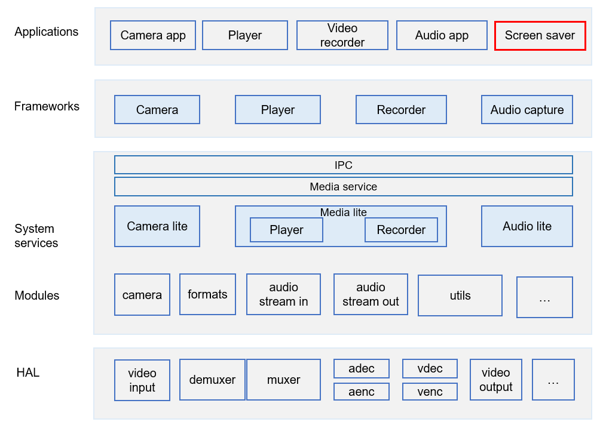

# CAMERA\_SCREENSAVER\_APP<a name="EN-US_TOPIC_0000001130489941"></a>

-   [Introduction](#section132119717356)
-   [Directory Structure](#section176641621345)
-   [Constraints](#section722512541395)
-   [Repositories Involved](#section16511040154318)

## Introduction<a name="section132119717356"></a>

This repository provides the screen saver capability. You can use it to:

-   Play the preset images.

-   Tap the screen to exit the screen saver.

**Figure  1**  Position of this repository in the graphics subsystem<a name="fig4460722185514"></a>  




## Directory Structure<a name="section176641621345"></a>

```
applications/sample/camera/screensaver
├── cert                Certificate
├── screensaver/src/main
       ├──resources     Resources
       ├──cpp           Source code
```

## Constraints<a name="section722512541395"></a>

C++ 11 or later

