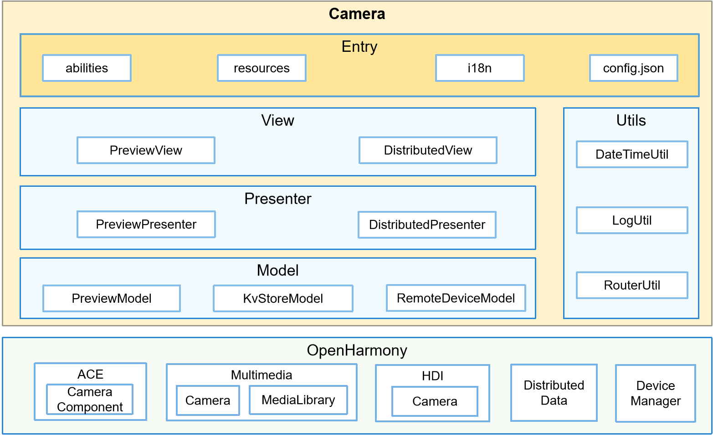

# Camera<a name="ZH-CN_TOPIC_0000001103554544"></a>

-   [Introduction](#section11660541593)
    -   [Architecture](#section78574815486)

-   [Directory Structure](#section161941989596)
-   [Repositories Involved](#section1371113476307)

## Introduction<a name="section11660541593"></a>

The Camera app is a system app pre-installed in the OpenHarmony standard system. It enables users to shoot photos with the local or a remote device, preview the shooting effect, view photo thumbnails, and open the camera album.

### Architecture<a name="section78574815486"></a>



## Directory Structure<a name="section161941989596"></a>

```
/applications/standard/camera/
├── figures                                             # Architecture figures
├── entry                                               # Camera main ability
│   └── src
│       └── main
│           ├── config.json                             # App configuration file
│           └── js                                      # JavaScript code
│                └──default
│                       ├──common                       # Public resources
│                           ├──component                # Custom components
│                                   └──PreviewDialog    # Dialog component for displaying the remote device list
│                           ├──media                    # Media resources 
│                           └──utils                    # Public utility classes
│                       ├──i18n                         # Character strings for globalization
│                       ├──model                        # Models
│                           ├──KvStoreModel             # Distributed data model
│                           ├──PreviewModel             # Model for the camera home screen
│                           └──RemoteDeviceModel        # Model for the remote device list
│                       ├──pages                        # Pages
│                           ├──DistributedView          # Page for distributed multi-device collaboration
│                           └──PreviewView              # Page for the camera home screen
│                       ├──presenter                    # Presenters
│                           ├──DistributedPresenter     # Encapsulates the logic for interaction between the distributed multi-device collaboration page and data.
│                           └──DreviewPresenter         # Encapsulates the logic for interaction between the camera home screen and data.
│                       └──app.js                       # File used for global JavaScript logic and app lifecycle management
│           └── resources                               # Resource files
├── signature                                           # Certificate file
├── LICENSE                                             # License file
```

## Repositories Involved<a name="section1371113476307"></a>

System apps

**applications\_camera**
