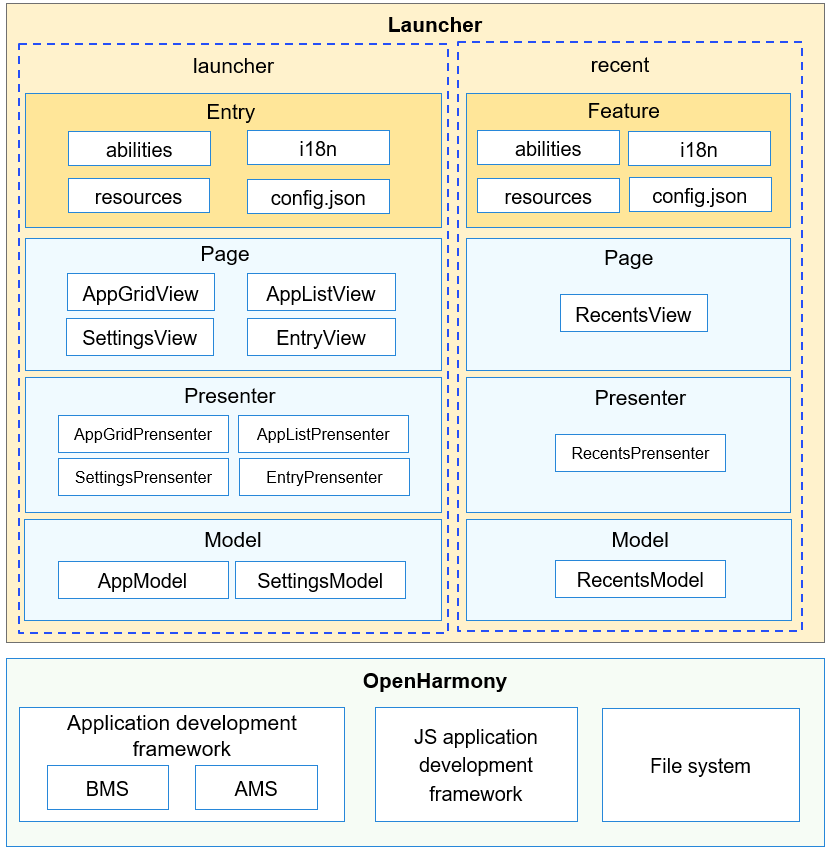

# Launcher<a name="EN-US_TOPIC_0000001103554544"></a>

-   [Introduction](#section11660541593)
    -   [Architecture](#section78574815486)

-   [Directory Structure](#section161941989596)
-   [Repositories Involved](#section1371113476307)

## Introduction<a name="section11660541593"></a>

The home screen launcher provides a main entry to human-machine interactions. It displays app icons for users to start or uninstall the apps, and allows users to set the home screen layout and manage recent tasks.

### Architecture<a name="section78574815486"></a>



## Directory Structure<a name="section161941989596"></a>

```
/applications/standard/launcher/
├── figures                  # Architecture figures
├── launcher                 # Main ability of the home screen, which provides the functions of displaying app icons, starting and uninstalling apps, and setting the home screen layout.
│   └── src
│       └── main
│           ├── config.json  # Global configuration files
│           ├── js           # JavaScript code
│           └── resources    # Resource configuration files
├── recents                  # Ability for managing recent tasks
│   └── src
│       └── main
│           ├── config.json  # Global configuration files
│           ├── js           # JavaScript code
│           └── resources    # Resource configuration files
├── signature                # Certificate files
├── LICENSE                  # License files
```

## Repositories Involved<a name="section1371113476307"></a>

System apps

**applications\_standard\_launcher**

