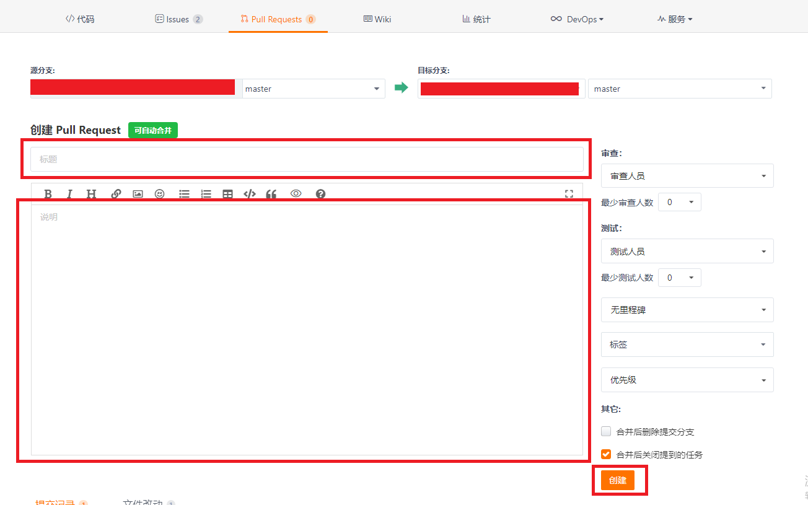

# Launcher 源码开发说明
## 1. 项目介绍
Launcher 作为系统人机交互的首要入口，提供应用图标的显示、点击启动、卸载应用，并提供桌面布局设置以及最近任务管理等功能。  
Launcher 采用纯 JS 语言开发，开发过程中不涉及任何 Java 部分的代码。
## 2. 工程结构
### 目录结构
```
/applications
├── common        # 公共模块目录
│   └── src
│       └── main
│           ├── ets  # ets代码目录
│               ├── default
│                   ├── base           # 公共presenter层代码目录
│                   ├── cache          # 缓存目录
│                   ├── common         # ets代码目录
│                       ├── configs       # 应用配置对象目录
│                       ├── constants     # 应用常量对象目录
│                       ├── model         # Model层代码目录
│                   ├── manager        # manager代码目录
│                   ├── uicomponents   # 自定义组件目录
│                   ├── utils          # 工具类代码目录
│           ├── resources  # 资源目录
│           ├── config.json  # 项目配置信息
├── feature        # feature层模块目录
│   └── layoutmanager        # 主launcher模块目录
│       └── src
│           └── main
│               ├── ets  # ets代码目录
│                   ├── default
│                       ├── common      # ets代码目录
│                           ├── configs    # 应用配置对象目录
│                           ├── constants  # 应用常量对象目录
│                           ├── presenter  # presenter层代码目录
│                       ├── layout      # 业务特性的View层目录
│              ├── resources  # 资源目录
│              ├── config.json  # 项目配置信息
│   └── recents        # 最近任务模块目录
│       └── src
│           └── main
│               ├── ets  # ets代码目录
│                   ├── default
│                       ├── common      # ets代码目录
│                           ├── model      # Model层代码目录
│                           ├── pics       # 应用图片目录
│                           ├── presenter  # presenter层代码目录
│                       ├── pages       # 业务特性的View层目录
│               ├── resources  # 资源目录
│               ├── config.json  # 项目配置信息
│   └── settings        # 桌面设置模块目录
│       └── src
│           └── main
│               ├── ets  # ets代码目录
│                   ├── default
│                       ├── common      # ets代码目录
│                           ├── constants  # 应用常量对象目录
│                           ├── presenter  # presenter层代码目录
│                       ├── pages       # 业务特性的View层目录
│               ├── resources  # 资源目录
│               ├── config.json  # 项目配置信息
├── product             # 产品层模块目录
│   └── phone        # phone模式模块目录
│       └── src
│           └── main
│               ├── ets  # ets代码目录
│                   ├── default
│                       ├── common      # ets代码目录
│                           ├── configs    # 应用配置对象目录
│                           ├── constants  # 应用常量对象目录
│                           ├── pics       # 应用图片目录
│                       ├── pages      # 业务特性的View层目录
│               ├── resources  # 资源目录
│               ├── config.json  # 项目配置信息
```
### 整体架构


Launcher 整体以 OpenHarmony 既有的 MVVM 的 App 架构设计为基础，向下扩展出一套 MVP（View, Presenter, Model）分层架构（既有的 MVVM 框架整体理解为新扩展的 MVP 框架的 View 层），用于处理 Launcher 的业务逻辑与数据管理。
应用整体采用了多模块的设计方式，每个模块都遵循上述架构原则。

各层的作用分别如下：
- 视图层（View）：负责更新 UI 显示以及触摸与点击事件的监听。
- 展现层（Presenter）：负责处理视图层（View）发送的业务逻辑处理请求，并连通 Model 层获取数据。
- 模型层（Model）：负责处理展现层（Presenter） 中关于数据处理的请求以及返回数据请求结果。

应用各层中重要类及其功能如下表所示
|模块|层级|类名|作用|
|-|-|-|-|
|launcher|视图层|EntryView|桌面入口画面的视图层逻辑控制类。|
|launcher|视图层|AppGridView|桌面网格视图画面的视图层逻辑控制类。|
|launcher|视图层|AppListView|桌面列表视图画面的视图层逻辑控制类。|
|launcher|展现层|EntryPresenter|桌面入口画面的展现层业务逻辑类，主要职责是判断桌面类型，以决定展现网格视图或者列表视图。|
|launcher|展现层|AppGridPresenter|桌面网格布局的展现层业务逻辑类，主要职责是接收视图层请求，处理逻辑业务，业务逻辑处理后实现功能或者向模型层发送请求。|
|launcher|展现层|AppListPresenter|桌面列表布局的展现层业务逻辑类，主要职责是接收视图层请求，处理逻辑业务，业务逻辑处理后实现功能或者向模型层发送请求。|
|launcher|模型层|AppModel|接收展现层AppGridPresenter和AppListPresenter发送过来的请求，为其提供所需要的数据或实现其请求的功能。|
|launcher|模型层|SettingsModel|接收展现层EntryPresenter和SettingsPresenter发送过来的请求，为其提供所需要的数据或实现其请求的功能。|
|recent|视图层|RecentsView|最近任务列表视图画面的视图层逻辑控制类。|
|recent|展现层|RecentsPresenter|最近任务列表的展现层业务逻辑类，主要职责是接收视图层请求，处理逻辑业务，业务逻辑处理后实现功能或者向模型层发送请求。|
|recent|模型层|RecentsModel|接收展现层RecentsPresenter发送过来的请求，为其提供所需要的数据或实现其请求的功能。|
|settings|视图层|SettingsView|桌面设置画面的视图层层逻辑控制类。|
|settings|展现层|SettingsPresenter|设置桌面画面的业务逻辑类，主要职责是处理来自视图层的请求，业务逻辑处理后实现功能或者向模型层发送请求。|
|settings|模型层|SettingsModel|接收展现层EntryPresenter和SettingsPresenter发送过来的请求，为其提供所需要的数据或实现其请求的功能。|


## 3. 基础开发说明
### 异步回调的使用
在JS工程中，异步回调的使用是一个非常常见的编码需求，在 OpenHarmony 的开发中也不例外，这里以获取应用列表信息为例，演示如何在 OpenHarmony 的应用开发中使用回调方法。

假设我们的系统结构为MVP，现在要在Presenter（`AppPresenter.js`）层获取Model（`AppModel.js`）层提供的应用列表数据，并返回给View（`AppView.js`）层中使用。

1. 在 `AppModel.js` 中添加获取应用信息的方法。
```JS
import BundleMgr from '@ohos.bundle';

export default class AppModel {
   
   // 获取应用信息
   getApplicationInfos(callback) {
      
      // callback 为传入的异步回调方法
      BundleMgr.getAllBundleInfo().then(data => {
         
         // 在获取数据成功后，执行回调方法
         callback(data);
      });
   }
}
```

2. 在 `AppPresenter.js` 中定义供 View 层获取数据的方法 `getApplicationInfos(callback)`。
```JS
export default class AppPresenter {

   constructor(AppModel) {
      this.appModel = AppModel;
   }
   
   // 获取应用信息
   getApplicationInfos(callback) {
      appModel.getApplicationInfos(callback);
   }
}
```

3. 在 `AppView.js` 中定义获取数据的回调方法 `applicationInfosCallback(data)` （即上文中的 `AppModel.getApplicationInfos(callback)` 中的 `callback` 参数），并将其绑定到 `AppPresenter.getApplicationInfos(callback)` 的 `callback` 参数。
```JS
import AppPresenter from './AppListPresenter.js';

var appPresenter;

export default {
   data: {
      appList: []
   },
   onInit() {
      appPresenter = new AppPresenter(this.$app.$def.data.appModel);

      // 绑定回调方法
      appPresenter.getApplicationInfos(this.applicationInfosCallback.bind(this))
   },
   
   // 定义获取数据的回调方法
   applicationInfosCallback(data) {
      this.appList = data;
   }
}
```

这样，在 `AppModel.js` 中获取数据的方法 `getApplicationInfos` 异步执行成功后，就会将数据通过我们绑定的回调方法，回传到 `AppView.js` 中。

### 资源引用
#### 定义资源文件
- 在 `src/main/resources/`目录下，根据不同的资源类型，定义资源文件。
#### 引用资源
- 在有对应page的js文件中，可直接通过`$r()`引用。
  ```` JavaScript
  this.title = this.$r('app.string.title');

  ````
## 4. 典型接口的使用
1. 启动 Ability
```JS
import FeatureAbility from '@ohos.ability.featureAbility';
//参数paramAbilityname, paramBundleName 是对应应用的abilityname，bundleName
startAbility(paramAbilityname, paramBundleName) {
   FeatureAbility.startAbility({
      bundleName: paramBundleName,
      abilityName: paramAbilityname,
      requestCode: 1,
      abilityType: "PageAbility",
      want:{
            action: "action1",
            entities: ["entity1"],
            type: "PageAbility",
            flags: 2,
            elementName: {
               deviceId : "deviceId",
               bundleName : paramBundleName,
               
               abilityName : paramAbilityname,
            },
      },
      syncOption: 1,
   }).then(data =>
      console.info("Launcher promise::then : " + JSON.stringify(data))
   ).catch(error =>
      console.info("Launcher promise::catch : " +JSON.stringify(error) )
   );
}
  
```

2. 查询应用 bundle 信息
```JS
import BundleMgr from '@ohos.bundle';
//参数bundleName 是对应应用的bundleName
getBundleInfo(bundleName) {
   BundleMgr.getBundleInfo(bundleName).then(data => {
      console.info('Launcher getBundleInfo ' + data);
   });
}
```

3. 查询所有应用信息
   
```JS
import BundleMgr from '@ohos.bundle';

getApplicationInfos() {
   BundleMgr.getAllBundleInfo().then((data) => {
      console.info('Launcher getAllBundleInfo '+JSON.stringify(data));
   });
}
```
4. 卸载应用
```JS
import BundleMgr from '@ohos.bundle';
//参数bundleName 是对应应用的bundleName
uninstallApp(bundleName) {
   var result = BundleMgr.getBundleInstaller().then((data) =>{
      data.uninstall(bundleName,{
         param: {
            userId: 0,
            installFlag: 0,
            isKeepData: false
         }
      })
      console.info("Launcher uninstall data [" + JSON.stringfy(data) + "]");
   }).catch(error => console.info("Launcher uninstall err " + error));
}
```
5. Preferences 存取数据
```JS
import storage from '@ohos.data.storage';
//保存数据的落盘位置
const PREFERENCES_PATH = '/data/accounts/account_0/appdata/com.ohos.launcher/sharedPreference/LauncherPreference';
//键值对标识key，类似localStorage用法
const PREFERENCES_KEY = 'PREFERENCES_KEY';

save(data) {
   mPreferences.putSync(PREFERENCES_KEY, data);
   mPreferences.flushSync();
}

get() {
   var data = mPreferences.getSync(PREFERENCES_KEY, "defaultValue");
   return data;
}
```

6. 获取最近任务列表
```JS
import NapiAbilityManager from '@ohos.app.abilityManager';

getRecentMissions() {
   NapiAbilityManager.queryRunningAbilityMissionInfos().then((data) => {
       console.info("Launcher getRecentMissions data [" + data + "]");
   });
}
```

7. 移除指定任务
```JS
import NapiAbilityManager from '@ohos.app.abilityManager';
//参数missionId是所选择的最近任务的missionId
removeMission() {
   NapiAbilityManager.removeMission(missionId).then((data) => {
      console.info('Launcher removeMission data [' + data + ']');
   });
}
```

## 5. 签名打包
### 签名
#### 签名文件的获取
1. 拷贝 OpenHarmony 标准版的 prebuilts\signcenter 目录到操作目录。
2. 拷贝Launcher工程的 signature\launcher.p7b 到该目录下。

#### 签名文件的配置
打开项目工程，选择 File → Project Structure


选择 Modules → Signing Configs，将对应的签名文件配置如下，完成后点击Apply，再点击OK。


配置完成后，对应的build.gradle文件中会出现如下内容


### 打包
DevEco Studio 支持 debug 与 release 两种打包类型。可以在 OhosBuild Variants 窗口中进行切换。

 

#### release打包
1. 代码准备完成后，在 OhosBuild Variants 窗口的 Selected Variant 中选择 release   
   
    

2. 选择Build → Build Haps(s)/APP(s) → Build Hap(s)

   

3. 编译完成后，hap包会生成在工程目录下的 `\build\outputs\hap\release\`路径下（如果没有配置签名，则只会生成未签名的hap包）
   
   


## 6. 安装、运行、调试
### 应用安装
配置 hdc：
进入SDK目录中的toolchains文件夹下，获取文件路径：


并将此路径配置到环境变量中：


重启电脑使环境变量生效

***T.B.D 是否真的需要重启电脑？***

连接开发板，打开cmd命令窗口，执行`hdc list targets`，弹出窗口如下：


等待一段时间后，窗口出现如下打印，可回到输入 hdc list targets 的命令窗口继续操作:


再次输入hdc list targets，出现如下结果，说明hdc连接成功


获取 root 权限与读写权限：

```
hdc target mount
```

***T.B.D smode 不执行的情况下，hdc target mount 能否正常执行？***

将签名好的 hap 包放入设备的 `/system/app` 目录下，并修改hap包的权限。发送文件命令如下：

```
hdc file send 本地路径 /system/app/hap包名称
```
例：将当前本地目录的 `Launcher.hap` 文件放入到 `system/app/Launcher.hap` 文件中。
```
hdc file send Launcher.hap /system/app/Launcher.hap
```
> 注意，如果设备不存在 `/system/app` 目录，则需要手动创建该目录并修改权限。
> ```
> hdc shell
> cd system
> mkdir app
> chmod 777 app
> ```
> `/system/app` 目录放置系统应用，例如：Launcher，SystemUI，Settings 等。
> 
> 但hap包需要在该目录下手动设置权限
> ```
> chmod 666 hap包名
> ```
> 此目录应用不用手动安装，系统自动拉起。
### 应用运行
Launcher 属于系统应用，在将签名的 hap 包放入 `/system/app` 目录后，重启系统，应用会自动拉起。
```
hdc shell
reboot
（不可以直接执行hdc reboot，命令是无效的)
```
***T.B.D 直接执行 `reboot`，还是执行`hdc shell reboot`？***
> 注意，如果设备之前安装过系统应用，则需要执行如下两条命令清除设备中存储的应用信息才能够在设备重启的时候将我们装入设备的新 hap 包正常拉起。
> ```
> hdc shell rm -rf /data/accounts/
> hdc shell rm -rf /data/misc_de/0/mdds/0/default/bundle_manager_service
> ```
### 应用调试
#### log打印
- 在程序中添加 log
```JS
console.info("Launcher log info");
```
可以在DevEco Studio中查看log

#### log获取及过滤
- log获取
  
将log输出至文件  
```
hdc shell hilog > 输出文件名称
```

例：
在真实环境查看log，将全log输出到当前目录的hilog.log文件中
```
hdc shell hilog > hilog.log
```

- log过滤

在命令行窗口中过滤log
```
hilog | grep 过滤信息
```

例：过滤包含信息 Label 的 hilog
```
hilog | grep Label
```
## 7. 贡献代码
### Fork 代码仓库
1. 在码云上打开 Launcher 代码仓库（[仓库地址](https://gitee.com/openharmony/applications_launcher)）。
2. 点击仓库右上角的 Forked 按钮
   
3. 在弹出的画面中，选择将仓库 fork 到哪里，点击确认。
   
4. Fork 成功之后，会在自己的账号下看见 fork 的代码仓库。
   

### 提交代码
1. 访问我们自己在码云账号上 fork 的代码仓库，点击“克隆/下载”按钮，选择 SSH，点击“复制”按钮。
   

2. 在本地新建 Launcher 目录，在 Launcher 目录中执行如下命令
   ```
   git clone 步骤1中复制的地址
   ```

3. 修改代码。
   > 将代码引入工程，以及编译工程等相关内容请参见 **3. 代码使用** 部分的相关内容。
4. 提交代码到 fork 仓库。  
   > 修改后的代码，首先执行 `git add` 命令，然后执行 `git commit` 命令与 `git push` 命令，将代码 push 到我们自己的 fork 仓中。
   > 关于代码提交的这部分内容涉及 git 的使用，可以参照 [git官网](https://git-scm.com/) 的内容，在此不再赘述。

### 发起 Pull Request (PR)
在将代码提交到 fork 仓之后，我们可以通过发起 Pull Request（PR）的方式来为 OpenHarmony 的相关项目贡献代码。

1. 打开 fork 仓库。选择 `Pull Requests` → `新建 Pull Request`
   
   

2. 在 `新建 Pull Request` 画面填入标题与说明，点击 `创建` 按钮。
   
   
3. 创建 Pull Request 完成。 PR 创建完成后，会有专门的代码审查人员对代码进行评审，评审通过之后会合入相应的代码库。
   
   


