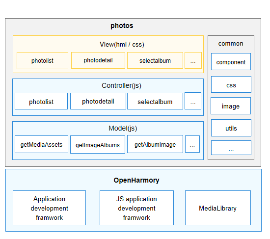

# 图库<a name="ZH-CN_TOPIC_0000001177189635"></a>

-   [简介](#section443318452403)
    -   [架构图](#section17686421134110)

-   [目录](#section7867113874118)
-   [相关仓](#section229716044218)

## 简介<a name="section443318452403"></a>

图库应用是在OpenHarmony标准系统中预制的系统应用，为用户提供基础的图片浏览、相册管理功能，包括图片、视频资源的查看、移动、复制、删除、重命名等功能。

### 架构图<a name="section17686421134110"></a>



## 目录<a name="section7867113874118"></a>

```
/applications/standard/photos/
├── figures                               # 架构图目录
├── entry                 
│   └── src
│       └── main
│           ├── config.json               # 全局配置文件
│           ├── resources                 # 资源配置文件存放目录
│           └── js                        # js代码目录
│               └── common                # 公共资源目录
│               └── i18n                  # 国际化
│               └── pages                 # 页面代码目录
├── signature                             # 证书文件目录
├── LICENSE                               # 许可文件
```

## 相关仓<a name="section229716044218"></a>

系统应用

**applications\_standard\_photos**

