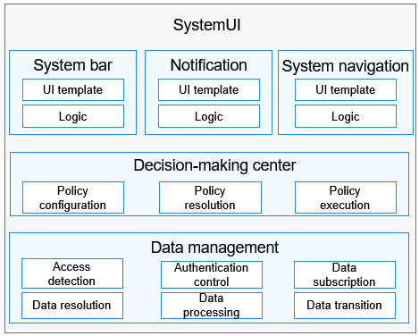

# SystemUI<a name="EN-US_TOPIC_0000001103330836"></a>

-   [Introduction](#section11660541593)
    -   [Architecture](#section125101832114213)

-   [Directory Structure](#section161941989596)
-   [Repositories Involved](#section1371113476307)

## Introduction<a name="section11660541593"></a>

SystemUI is a system app preinstalled in OpenHarmony. It provides users with interactive UIs that display system-related information, including the system status, prompts, and notifications \(such as the system time and battery level\).

### Architecture<a name="section125101832114213"></a>



## Directory Structure<a name="section161941989596"></a>

```
/applications/standard/systemui
├── figures                     # Architecture figures
├── entry                       # Main entry module code
│   └── src
│       ├── main
│           ├── js              # JavaScript code
│           ├── resources       # Resource configuration files
│           └── config.json     # Global configuration files
├── navigationBar               # System navigation module code
│   └── src
│       ├── main
│           ├── js              # JavaScript code
│           ├── resources       # Resource configuration files
│           └── config.json     # Global configuration files
├── signature                   # Certificate files
├── LICENSE                     # License files
```

## Repositories Involved<a name="section1371113476307"></a>

System apps

**applications\_systemui**

