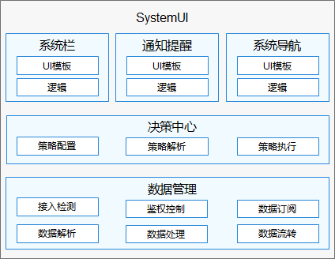

# SystemUI<a name="ZH-CN_TOPIC_0000001103330836"></a>

-   [简介](#section11660541593)
    -   [架构图](#section125101832114213)
-   [目录](#section161941989596)
-   [使用说明](#section123459000)
-   [相关仓](#section1371113476307)

## 简介<a name="section11660541593"></a>

SystemUI应用是OpenHarmony中预置的系统应用，为用户提供系统相关信息展示及交互界面，包括系统状态、系统提示、系统提醒等，例如系统时间、电量信息。

### 架构图<a name="section125101832114213"></a>



## 目录<a name="section161941989596"></a>

```
/applications/standard/systemui
    ├── build.gradle                    # 全局编译配置文件
    ├── settings.gradle                 # 编译模块配置文件
    ├── LICENSE                         # 许可文件
    ├── common                          # 通用工具类目录
    ├── entry                           # entry模块目录
    ├── signature                       # 证书文件目录
    ├── features                        # 子组件目录
    │   ├── batterycomponent            # 电池组件
    │   ├── clockcomponent              # 时间组件
    │   ├── control                     # 控制中心组件
    │   ├── navigationservice           # 导航栏服务组件
    │   ├── noticeitem                  # 通知子组件
    │   ├── notificationservice         # 通知服务组件
    │   ├── signalcomponent             # sim卡信号组件
    │   ├── wificomponent               # wifi组件
    ├── product                         # SystemUI总体功能目录
        ├── navigationBar               # 导航栏模块目录
        ├── statusbar                   # 状态栏模块目录
        ├── systemDialog                # 系统弹框模块目录
```
## 使用说明<a name="section123459000"></a>

   参见使用说明（[使用说明](./doc/Instructions.md)）

## 相关仓<a name="section1371113476307"></a>

系统应用

**applications\_systemui**

