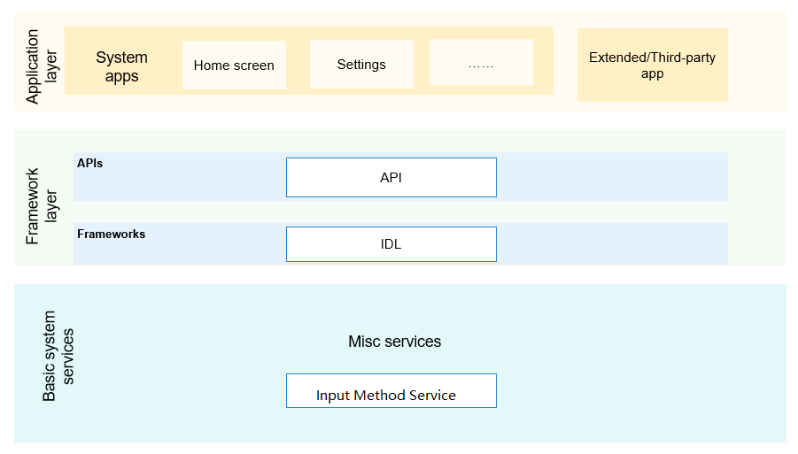

# miscservices_inputmethod

#### Introduction

Input Method Framework, is used to connect the application and input method. the application can input text through the input method

**图 1**  子系统架构图  

#### Warehouse path

/base/miscservices/inputmethod

#### Introduction to framework code

The input method framework currently has four modules, as follows:

1. Application client

Path: /base/miscservices/inputmethod/frameworks/inputmethod_controller

Function: realize the service delivery of application and input method framework, including the binding between application and input method service, application display and hiding request for input method, etc

2. Input method client

Path: /base/miscservices/inputmethod/frameworks/inputmethod_ability

Function: the intermediate bridge between input method framework service and input method delivery, including monitoring the current status of input method, etc

3. Input method service

Path: /base/miscservices/inputmethod/services

Function: as the core of the input method framework, the main processing logic of the input method is completed here

4. Input method JS interface

Path: /base/miscservices/inputmethod/interfaces/kits/JS

Function: the temporarily exposed JS interface is mainly reserved for calling input methods

#### Main functions supported by the framework

1. Click in the edit attribute control to invoke the default input method application through the input method framework

2. Typing can be carried out through the input method application, and characters can be input to the application client on the screen

#### Debugging method

1.   Compile command

./build.sh --product-name (Fill in the specific product name, such as：Hi3516DV300) --build-target inputmethod_native

2.  push so file

in $root\out\ohos-arm-release\miscservices\inputmethod_native, push libinputmethod_client.z.so libinputmethod_ability.z.so 
libinputmethod_service.z.so to system/lib，and push libinputmethodability.z.so to system/lib/module， and make sure the four so files is readable at least.

3.  reboot

####Participation contribution

1. Fork warehouse
2. Submission code
3. Create a new pull request
4. Commit is complete
