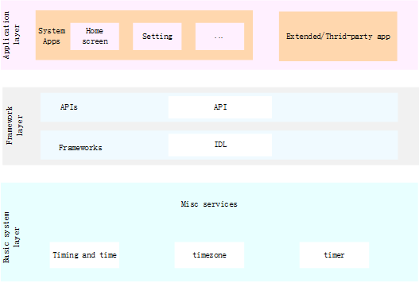

# Timing and Time<a name="EN-US_TOPIC_0000001115554184"></a>

-   [Introduction](#section11660541593)
-   [Directory Structure](#section161941989596)
-   [Usage](#section38521239153117)
    -   [Available JS APIs](#section11908203714422)
    -   [Sample Code](#section9938411124317)

-   [Repositories Involved](#section1371113476307)

## Introduction<a name="section11660541593"></a>

The timing and time module provides APIs for managing the system time.

**Figure  1**  Subsystem architecture<a name="fig143011012341"></a>  


## Directory Structure<a name="section161941989596"></a>

```
/base/miscservices/time
├── etc                      # Process configuration files
├── figures                  # Architecture diagram
├── interfaces               # APIs for external systems and applications
│   └── innerkits            # APIs between services
│   └── kits                 # APIs
├── profile                  # System service configuration files
└── services                 # Service implementation
```

## Usage<a name="section38521239153117"></a>

### Available JS APIs<a name="section11908203714422"></a>

**Table  1**  Major functions of systemTime

<a name="table033515471012"></a>
<table><thead align="left"><tr id="row143351854201012"><th class="cellrowborder" valign="top" width="50%" id="mcps1.2.3.1.1"><p id="p103351154121010"><a name="p103351154121010"></a><a name="p103351154121010"></a>Interface name</p>
</th>
<th class="cellrowborder" valign="top" width="50%" id="mcps1.2.3.1.2"><p id="p1033585416105"><a name="p1033585416105"></a><a name="p1033585416105"></a>describe</p>
</th>
</tr>
</thead>
<tbody><tr id="row204321219393"><td class="cellrowborder" valign="top" width="50%" headers="mcps1.2.3.1.1 "><p id="p1893413268144"><a name="p1893413268144"></a><a name="p1893413268144"></a>function setTime(time : number) : Promise&lt;boolean&gt;</p>
</td>
<td class="cellrowborder" valign="top" width="50%" headers="mcps1.2.3.1.2 "><p id="p18761104812149"><a name="p18761104812149"></a><a name="p18761104812149"></a>Set the system time (1970-01-01 to the present in milliseconds), Promise method</p>
</td>
</tr>
<tr id="row13335054111018"><td class="cellrowborder" valign="top" width="50%" headers="mcps1.2.3.1.1 "><p id="p12832214151418"><a name="p12832214151418"></a><a name="p12832214151418"></a>function setTime(time : number, callback : AsyncCallback&lt;boolean&gt;) : void</p>
</td>
<td class="cellrowborder" valign="top" width="50%" headers="mcps1.2.3.1.2 "><p id="p3335145451011"><a name="p3335145451011"></a><a name="p3335145451011"></a>Set the system time (1970-01-01 to the present in milliseconds), callback mode</p>
</td>
</tr>
<tr id="row204321219393"><td class="cellrowborder" valign="top" width="50%" headers="mcps1.2.3.1.1 "><p id="p1893413268144"><a name="p1893413268144"></a><a name="p1893413268144"></a>function setDate(date: Date, callback: AsyncCallback&lt;boolean&gt;): void;</p>
</td>
<td class="cellrowborder" valign="top" width="50%" headers="mcps1.2.3.1.2 "><p id="p18761104812149"><a name="p18761104812149"></a><a name="p18761104812149"></a>Set the system time (Date format), Promise method</p>
</td>
</tr>
<tr id="row204321219393"><td class="cellrowborder" valign="top" width="50%" headers="mcps1.2.3.1.1 "><p id="p1893413268144"><a name="p1893413268144"></a><a name="p1893413268144"></a>function setDate(date: Date): Promise&lt;boolean&gt;</p>
</td>
<td class="cellrowborder" valign="top" width="50%" headers="mcps1.2.3.1.2 "><p id="p18761104812149"><a name="p18761104812149"></a><a name="p18761104812149"></a>Set system time (Date format), callback method</p>
</td>
</tr>
<tr id="row204321219393"><td class="cellrowborder" valign="top" width="50%" headers="mcps1.2.3.1.1 "><p id="p1893413268144"><a name="p1893413268144"></a><a name="p1893413268144"></a>function setTimezone(timezone: string, callback: AsyncCallback&lt;boolean&gt;): void</p>
</td>
<td class="cellrowborder" valign="top" width="50%" headers="mcps1.2.3.1.2 "><p id="p18761104812149"><a name="p18761104812149"></a><a name="p18761104812149"></a>Set the system time zone, callback method</p>
</td>
</tr>
<tr id="row204321219393"><td class="cellrowborder" valign="top" width="50%" headers="mcps1.2.3.1.1 "><p id="p1893413268144"><a name="p1893413268144"></a><a name="p1893413268144"></a>function setTimezone(timezone: string): Promise&lt;boolean&gt;</p>
</td>
<td class="cellrowborder" valign="top" width="50%" headers="mcps1.2.3.1.2 "><p id="p18761104812149"><a name="p18761104812149"></a><a name="p18761104812149"></a>Set the system time zone, Promise method</p>
</td>
</tr>
</tbody>
</table>


**表 2** Major functions of systemTimer

<a name="table033515471012"></a>
<table><thead align="left"><tr id="row143351854201012"><th class="cellrowborder" valign="top" width="50%" id="mcps1.2.3.1.1"><p id="p103351154121010"><a name="p103351154121010"></a><a name="p103351154121010"></a>Interface name</p>
</th>
<th class="cellrowborder" valign="top" width="50%" id="mcps1.2.3.1.2"><p id="p1033585416105"><a name="p1033585416105"></a><a name="p1033585416105"></a>describe</p>
</th>
</tr>
</thead>
<tbody><tr id="row204321219393"><td class="cellrowborder" valign="top" width="50%" headers="mcps1.2.3.1.1 "><p id="p1893413268144"><a name="p1893413268144"></a><a name="p1893413268144"></a>function createTimer(options: TimerOptions, callback: AsyncCallback&lt;number&gt;): void</p>
</td>
<td class="cellrowborder" valign="top" width="50%" headers="mcps1.2.3.1.2 "><p id="p18761104812149"><a name="p18761104812149"></a><a name="p18761104812149"></a>Create timer, callback method</p>
</td>
</tr>
<tr id="row13335054111018"><td class="cellrowborder" valign="top" width="50%" headers="mcps1.2.3.1.1 "><p id="p12832214151418"><a name="p12832214151418"></a><a name="p12832214151418"></a>function createTimer(options: TimerOptions): Promise&lt;number&gt;</p>
</td>
<td class="cellrowborder" valign="top" width="50%" headers="mcps1.2.3.1.2 "><p id="p3335145451011"><a name="p3335145451011"></a><a name="p3335145451011"></a>Create timer, promise method</p>
</td>
</tr>
<tr id="row204321219393"><td class="cellrowborder" valign="top" width="50%" headers="mcps1.2.3.1.1 "><p id="p1893413268144"><a name="p1893413268144"></a><a name="p1893413268144"></a>function startTimer(timer: number, triggerTime: number, callback: AsyncCallback&lt;boolean&gt;): void</p>
</td>
<td class="cellrowborder" valign="top" width="50%" headers="mcps1.2.3.1.2 "><p id="p18761104812149"><a name="p18761104812149"></a><a name="p18761104812149"></a>Start the timer, callback mode</p>
</td>
</tr>
<tr id="row204321219393"><td class="cellrowborder" valign="top" width="50%" headers="mcps1.2.3.1.1 "><p id="p1893413268144"><a name="p1893413268144"></a><a name="p1893413268144"></a>function startTimer(timer: number, triggerTime: number): Promise&lt;boolean&gt;</p>
</td>
<td class="cellrowborder" valign="top" width="50%" headers="mcps1.2.3.1.2 "><p id="p18761104812149"><a name="p18761104812149"></a><a name="p18761104812149"></a>Start the timer, promise mode</p>
</td>
</tr>
<tr id="row204321219393"><td class="cellrowborder" valign="top" width="50%" headers="mcps1.2.3.1.1 "><p id="p1893413268144"><a name="p1893413268144"></a><a name="p1893413268144"></a>function stopTimer(timer: number, callback: AsyncCallback&lt;boolean&gt;):  void</p>
</td>
<td class="cellrowborder" valign="top" width="50%" headers="mcps1.2.3.1.2 "><p id="p18761104812149"><a name="p18761104812149"></a><a name="p18761104812149"></a>Stop the timer, callback mode</p>
</td>
</tr>
<tr id="row204321219393"><td class="cellrowborder" valign="top" width="50%" headers="mcps1.2.3.1.1 "><p id="p1893413268144"><a name="p1893413268144"></a><a name="p1893413268144"></a>function stopTimer(timer: number): Promise&lt;boolean&gt;</p>
</td>
<td class="cellrowborder" valign="top" width="50%" headers="mcps1.2.3.1.2 "><p id="p18761104812149"><a name="p18761104812149"></a><a name="p18761104812149"></a>Stop the timer, promise mode</p>
</td>
</tr>
<tr id="row204321219393"><td class="cellrowborder" valign="top" width="50%" headers="mcps1.2.3.1.1 "><p id="p1893413268144"><a name="p1893413268144"></a><a name="p1893413268144"></a>function destroyTimer(timer: number, callback: AsyncCallback&lt;boolean&gt;): void</p>
</td>
<td class="cellrowborder" valign="top" width="50%" headers="mcps1.2.3.1.2 "><p id="p18761104812149"><a name="p18761104812149"></a><a name="p18761104812149"></a>Destroy the timer, callback method</p>
</td>
</tr>
<tr id="row204321219393"><td class="cellrowborder" valign="top" width="50%" headers="mcps1.2.3.1.1 "><p id="p1893413268144"><a name="p1893413268144"></a><a name="p1893413268144"></a>function destroyTimer(timer: number): Promise&lt;boolean&gt;</p>
</td>
<td class="cellrowborder" valign="top" width="50%" headers="mcps1.2.3.1.2 "><p id="p18761104812149"><a name="p18761104812149"></a><a name="p18761104812149"></a>Destroy the timer, the promise method</p>
</td>
</tr>
</tbody>
</table>

**表 3**  parameter TimerOptions description of systemTimer

<a name="table033515471012"></a>
<table><thead align="left"><tr id="row143351854201012"><th class="cellrowborder" valign="top" width="20%" id="mcps1.2.3.1.1"><p id="p103351154121010"><a name="p103351154121010"></a><a name="p103351154121010"></a>name</p>
</th>
<th class="cellrowborder" valign="top" width="10%" id="mcps1.2.3.1.2"><p id="p1033585416105"><a name="p1033585416105"></a><a name="p1033585416105"></a>type</p>
</th>
<th class="cellrowborder" valign="top" width="70%" id="mcps1.2.3.1.3"><p id="p1033585416105"><a name="p1033585416105"></a><a name="p1033585416105"></a>illustrate</p>
</th>
</tr>
</thead>
<tbody><tr id="row204321219393"><td class="cellrowborder" valign="top" width="20%" headers="mcps1.2.3.1.1 "><p id="p1893413268144"><a name="p1893413268144"></a><a name="p1893413268144"></a>type</p>
</td>
<td class="cellrowborder" valign="top" width="10%" headers="mcps1.2.3.1.2 "><p id="p18761104812149"><a name="p18761104812149"></a><a name="p18761104812149"></a>number</p>
</td>
<td class="cellrowborder" valign="top" width="70%" headers="mcps1.2.3.1.3 "><p id="p18761104812149"><a name="p18761104812149"></a><a name="p18761104812149"></a>TIMER_TYPE_REALTIME:  Set as the system startup time timer, otherwise it is the walltime timer;   
  TIMER_TYPE_WAKEUP: Set to wake-up timer, otherwise it is non-wake-up;   
  const TIMER_TYPE_EXACT: Set as a precision timer, otherwise it is a non-precision timer;   
  const TIMER_TYPE_IDLE: Set to IDLE mode timer, otherwise it is non-IDLE mode timer (not supported yet)   
</p>
</td>
</tr>
<tr id="row204321219393"><td class="cellrowborder" valign="top" width="20%" headers="mcps1.2.3.1.1 "><p id="p1893413268144"><a name="p1893413268144"></a><a name="p1893413268144"></a>repeat</p>
</td>
<td class="cellrowborder" valign="top" width="10%" headers="mcps1.2.3.1.2 "><p id="p18761104812149"><a name="p18761104812149"></a><a name="p18761104812149"></a>boolean</p>
</td>
<td class="cellrowborder" valign="top" width="70%" headers="mcps1.2.3.1.3 "><p id="p18761104812149"><a name="p18761104812149"></a><a name="p18761104812149"></a>true Is a cyclic timer, false is a single timer</p>
</td>
</tr>
<tr id="row204321219393"><td class="cellrowborder" valign="top" width="20%" headers="mcps1.2.3.1.1 "><p id="p1893413268144"><a name="p1893413268144"></a><a name="p1893413268144"></a>interval</p>
</td>
<td class="cellrowborder" valign="top" width="10%" headers="mcps1.2.3.1.2 "><p id="p18761104812149"><a name="p18761104812149"></a><a name="p18761104812149"></a>number</p>
</td>
<td class="cellrowborder" valign="top" width="70%" headers="mcps1.2.3.1.3 "><p id="p18761104812149"><a name="p18761104812149"></a><a name="p18761104812149"></a>If it is a cyclic timer, the repeat value should be greater than 5000 milliseconds, and the non-repeated timer is set to 0</p>
</td>
</tr>
<tr id="row204321219393"><td class="cellrowborder" valign="top" width="20%" headers="mcps1.2.3.1.1 "><p id="p1893413268144"><a name="p1893413268144"></a><a name="p1893413268144"></a>wantAgent</p>
</td>
<td class="cellrowborder" valign="top" width="10%" headers="mcps1.2.3.1.2 "><p id="p18761104812149"><a name="p18761104812149"></a><a name="p18761104812149"></a>wantAgent</p>
</td>
<td class="cellrowborder" valign="top" width="70%" headers="mcps1.2.3.1.3 "><p id="p18761104812149"><a name="p18761104812149"></a><a name="p18761104812149"></a>Set the wantagent to notify, and notify when the timer expires</p>
</td>
</tr>
<tr id="row204321219393"><td class="cellrowborder" valign="top" width="20%" headers="mcps1.2.3.1.1 "><p id="p1893413268144"><a name="p1893413268144"></a><a name="p1893413268144"></a>callback</p>
</td>
<td class="cellrowborder" valign="top" width="10%" headers="mcps1.2.3.1.2 "><p id="p18761104812149"><a name="p18761104812149"></a><a name="p18761104812149"></a> => void</p>
</td>
<td class="cellrowborder" valign="top" width="70%" headers="mcps1.2.3.1.3 "><p id="p18761104812149"><a name="p18761104812149"></a><a name="p18761104812149"></a>Set the callback function, which will be triggered after the timer expires</p>
</td>
</tr>
</tbody>
</table>

### Sample Code<a name="section9938411124317"></a>

Example fo using systemTime

```
// Import the module.
import systemTime from '@ohos.systemTime';

// Set the system time asynchronously with a Promise.
var time = 1611081385000;   
systemTime.setTime(time)    
      .then((value) => {        
          console.log(`success to systemTime.setTime: ${value}`);   
       }).catch((err) => {        
          console.error(`failed to systemTime.setTime because ${err.message}`)  
    });

// Set the system time asynchronously with a callback.   
var time = 1611081385000;   
systemTime.setTime(time, (err, value) => {   
     if (err) {        
          console.error(`failed to systemTime.setTime because ${err.message}`);   
           return;   
         }    
       console.log(`success to systemTime.setTime: ${value}`);   
    });

```
Example fo using systemTimer

// Import the module 
import systemTimer from '@ohos.systemTimer';

console.log("start")   
var options:TimerOptions{   
   type:TIMER_TYPE_REALTIME,   
   repeat:false,   
   interval:Number.MAX_VALUE/2,   
   persistent:false   
}

console.log("create timer")   
let timerId = systemTimer.Timer(options)     
console.log("start timer")   
let startTimerRes = systemTimer.startTimer(timerId, 100000)   
console.log("stop timer")   
let stopTimerRes = systemTimer.stopTimer(timerId)   
console.log("destroy timer")   
let destroyTimerRes = systemTimer.destroyTimer(timerId)   
console.log('end');   


```

## Repositories Involved<a name="section1371113476307"></a>

**Misc services subsystem**

miscservices\_time

