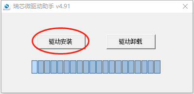
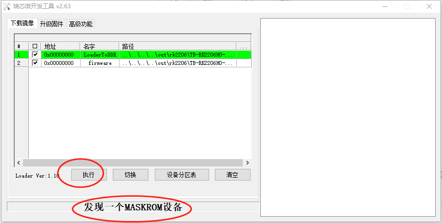

# 烧写准备

## 进入烧写模式

1. USB线连接OTG接口

2. 按住核心板上的Maskrom按键后重启系统，系统将进入"Maskrom模式"。

# Windows主机烧写固件

## 安装USB驱动

双机*windows\DriverAssitant\ DriverInstall.exe*打开安装程序，点击下图所示的“驱动安装”按钮，按提示安装USB驱动：



*说明：如果已经安装旧版本的烧写工具，请先点击"驱动卸载"按钮下载驱动，然后再点击"驱动安装"按钮安装驱动*。

## 打开烧写工具

双机*windows\RKDevTool.exe*打开烧写工具，工具界面如下图所示：



## 查看开发板是否进入烧写模式

2. 如果界面显示"发现一个MASKROM设备", 说明开发板进入Maskrom模式等待烧写固件。

3. 如果界面显示"没有发现设备"，说明开发板没有进入烧写模式，请按文档第一章节操作让开发板进入烧写模式。


## 烧写固件

1. *out/rk2206/TB-RK2206H0-A/images*目录下。

2. 勾选需要烧写的固件，点击烧写工具的"执行"按钮，开始烧写固件。

   *说明：*
   
    *如果烧写成功，在工具界面右侧会显示烧写成功*
   
   *如果烧写失败，在工具界面右侧会用红色的字体显示烧写错误信息，更多出错信息查看：Log目录下的文件*

# Linux命令行烧写固件

## 查看开发板是否进入烧写模式

进入OHOS的根目录，执行如下命令查看：

```
python3 flash.py -q
```

*说明：*

2. *如果输出"maskrom", 说明开发板进入Maskrom模式等待烧写固件*
3. *如果输出"none"，说明开发板没有进入烧写模式，请按文档第一章节操作让开发板进入烧写模式*

## 烧写固件

执行如下命令烧写固件：

1. 烧写固件：

```
python3 flash.py
```
