# vendor_lockzhiner_rk2206

## 介绍

### 文件目录

```
vendor/lockzhiner/rk2206
|---- docs				# 小凌派-RK2206相关文档，包括硬件原理图、课程PPT等
|---- hals                              # hals适配目录
|---- hdf_config                        # hdf配置
|---- hdf_drivers                       # hdf驱动
|---- image				# MD文档的图片
|---- samples                           # 小凌派-RK2206相关应用案例
```

### 章节目录

1. 准备工作
2. 开始下载
3. 部署环境
4. 在windows上远程连接服务器
5. ubuntu文件映射到windows上
6. ubuntu获取源代码
7. 编译流程
8. 烧录打印

## 1、准备工作

准备一台电脑，安装Windows系统

## 2、开始下载

### 2.1、下载Ubuntu系统镜像

下载网址（百度云）：https://pan.baidu.com/s/1IfT0onLb1kcoByhOUU-kyA
提取码：eikl

```
Ubuntu系统镜像是Ubuntu 20.04.3 LTS 64位系统版本，已安装相对应的编译环境。其中，账号主要有2个：
（1）lzdz
    账号：lzdz
    密码：123456
（2）root
    账号：root
    密码：123456
```

### 2.2、下载并安装VBox工具

下载网址（百度云）：https://pan.baidu.com/s/1EYgUAO1_2N0GluF7h8HvBQ
提取码：eekp

### 2.3、下载并安装MobaXterm工具

下载网址（百度云）：https://pan.baidu.com/s/1FGz4TEJ3Np-ppP1-o0E05g
提取码：n0ll

### 2.4、下载并安装烧写工具

下载网址（百度云）：https://pan.baidu.com/s/1SU99yvtPehkRzBKH2jzNtA
提取码：1adc

### 2.5、下载并安装USB驱动

下载网址（百度云）：https://pan.baidu.com/s/1s_zEuDU_OpcltaJUZNvbLA
提取码：9slw

### 2.6、下载并安装VSCode

下载网址（百度云）：https://pan.baidu.com/s/1gi5froBzuSjLjvV4syKQ0A
提取码：iv3k

## 3、部署环境

### 3.1、安装VBox虚拟机

请安装 `VirtualBox-6.1.32-149290-Win.exe`可执行文件（请参考网上[详细教程](https://www.jianshu.com/p/bfb4f4415411 "VirtualBox安装")）。

### 3.2、加载Ubuntu系统镜像

#### 3.2.1、加载Ubuntu镜像

将Ubuntu.rar文件解压到某一个盘下，打开 `Oracle VM VirutalBox`，点击 `注册`，出现如下图所示：

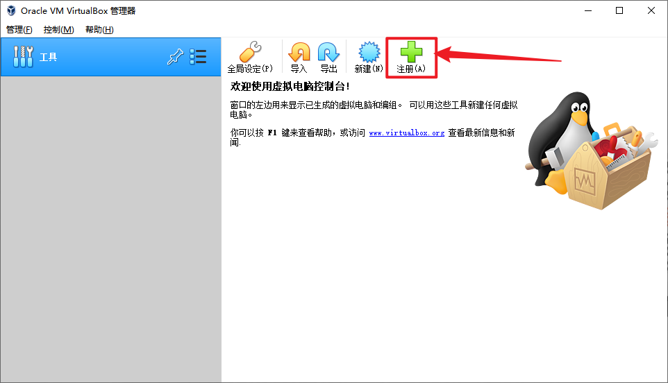

出现打开对话框，选中Ubuntu镜像文件（即Ubuntu.vbox）。如下图所示：

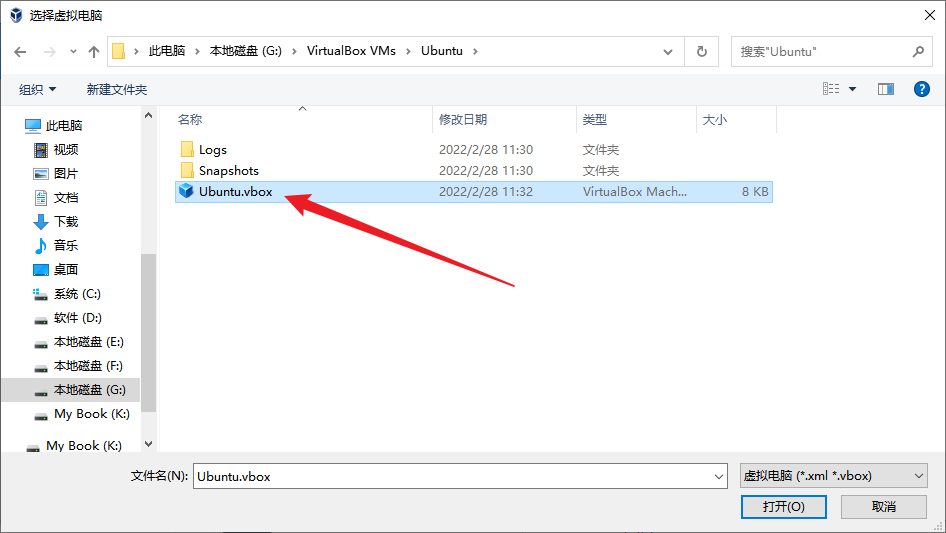

#### **3.2.2、配置Ubuntu镜像**

点击选中 `Ubuntu`，点击设置 `按钮`，如下图所示：

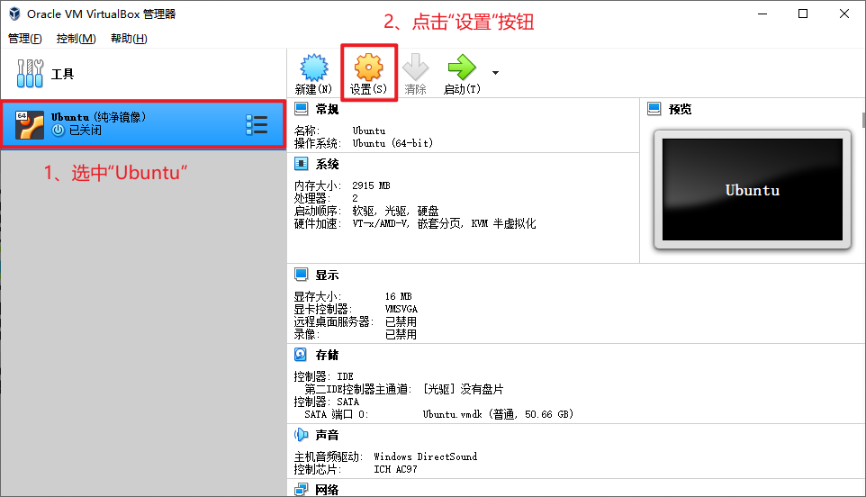

（1）配置内存。

弹出设置对话框，点击 `系统`，再点击 `主板`，在 `内存大小`中选择合适的内存（建议为Windows最大内存的一半）。

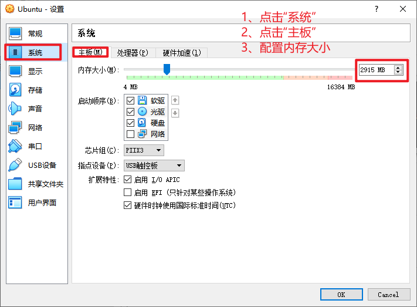

（2）配置CPU

在设置对话框，点击 `系统`，再点击 `主板`，在 `处理器`中选择合适的处理器数量（建议为Windows处理器的一半）。

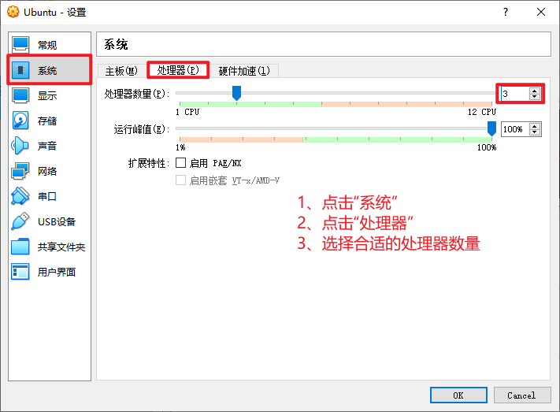

（3）配置网络

在设置对话框，点击 `网络`，再点击 `网卡1`，选中 `启用网络连接`，在 `连接方式`中选择 `桥接方式`，在 `界面名称`中选择可以连接外部网络的一个网卡。

注意：用户也可以在 `连接方式`中选择 `网络地址转换(NAT)`。

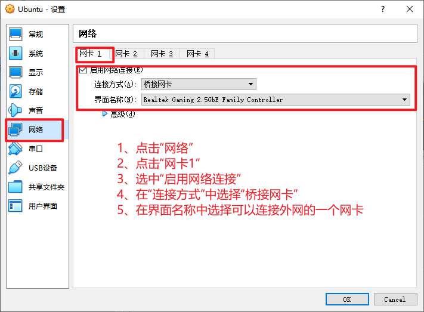

（4）配置USB

在设置对话框，点击 `USB设备`，再取消 `启用USB控制器`。

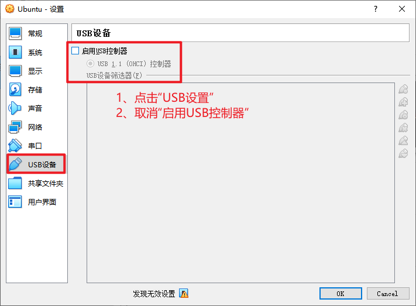

#### 3.2.3、启动Ubuntu镜像

上述设置完毕后，点击 `启动(T)`。

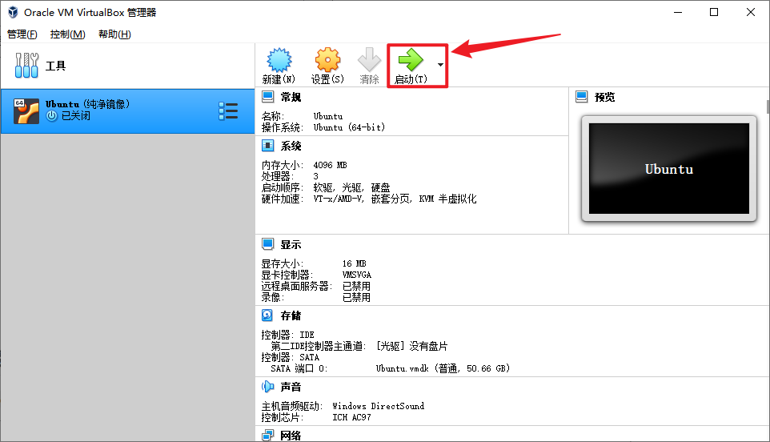

Ubuntu系统正式启动，如下所示：

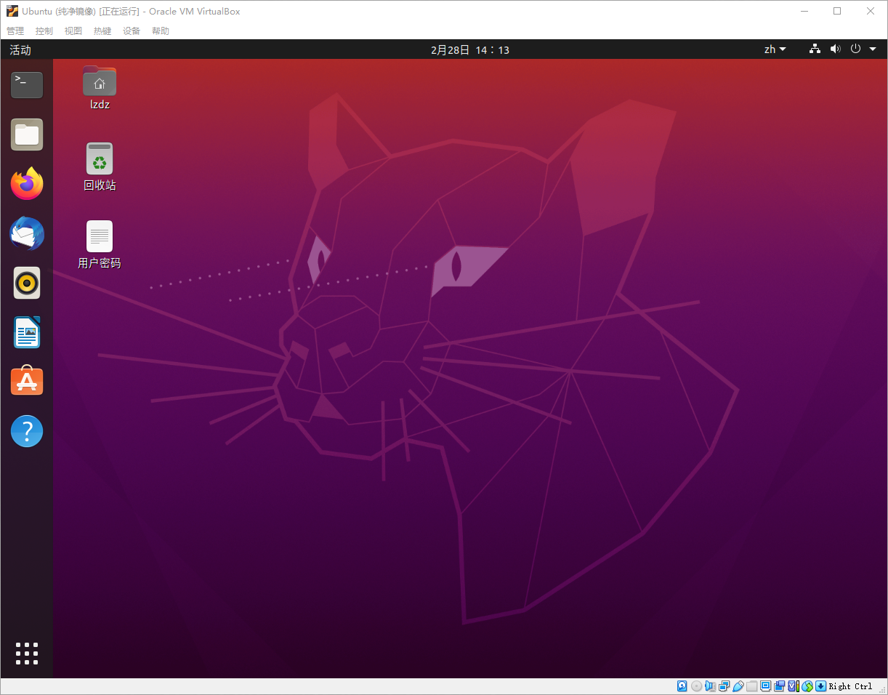

#### 3.2.4、获知Ubuntu系统的IP地址

点击左下角的图标，在搜索框中输入 `terminal`

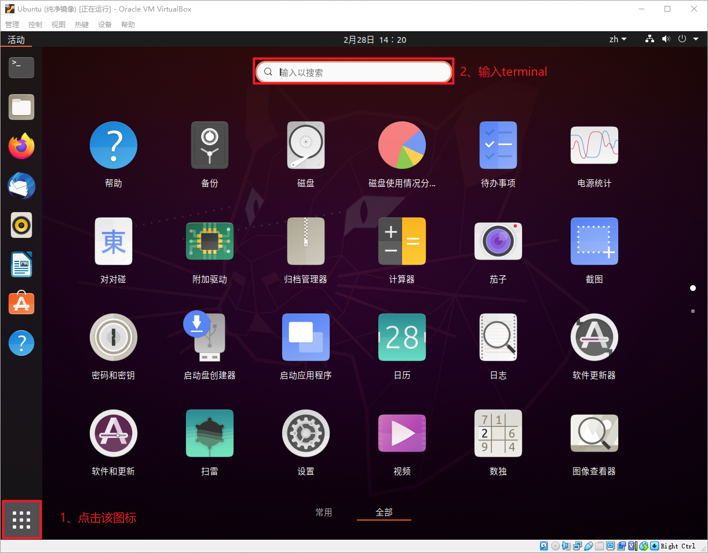

弹出终端界面，输入命令：ip addr show

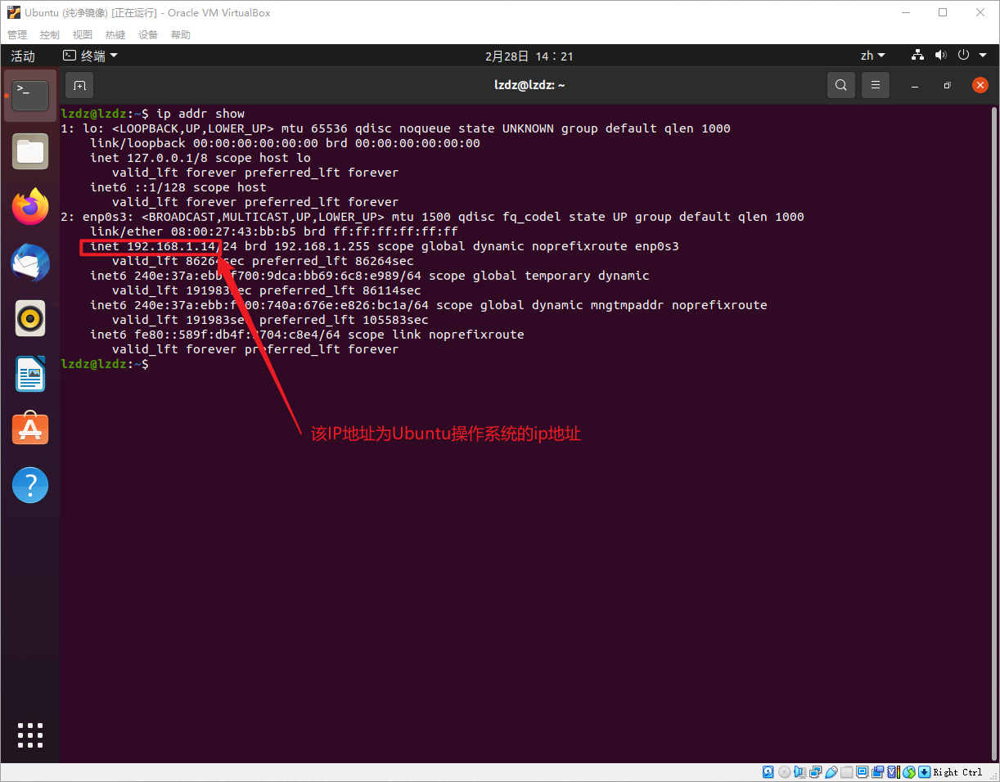

请记住，该IP地址为Ubuntu操作系统的IP地址。后续需要使用该IP地址

## 4、在windows上远程连接服务器

（1）打开 `MobaXterm`工具，并点击：`Seesion`，`SSH`按钮。

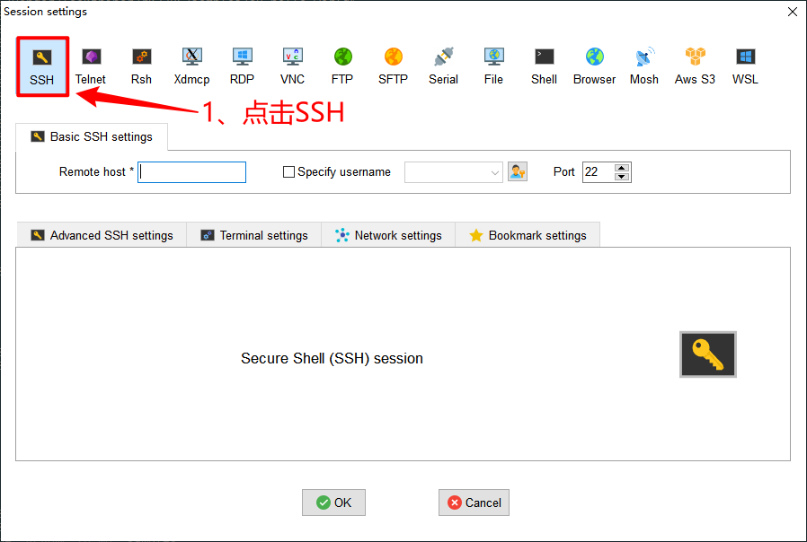

（2）输入连接信息，远程地址，并点击OK

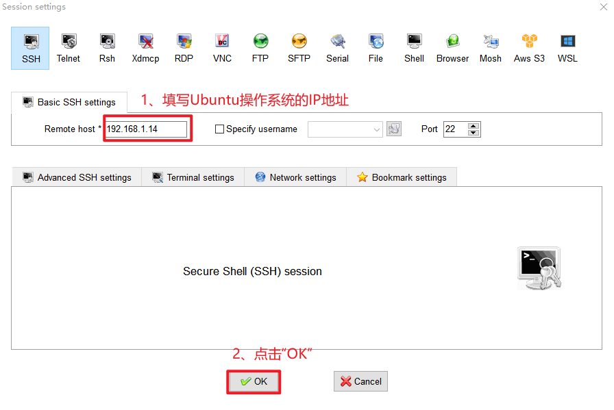

（3）弹出对话框，点击 `是(Y)`

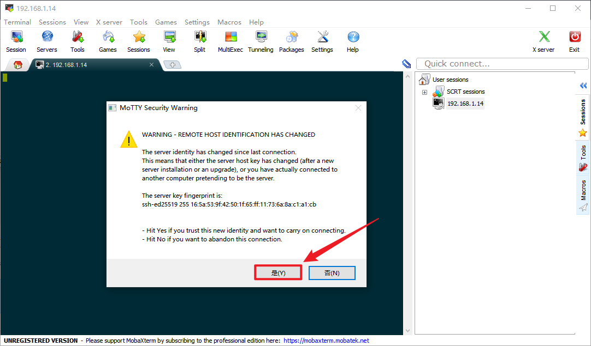

（3）输入账号和密码

Ubuntu操作系统分为2个账号：

* 账号：lzda；密码：123456（一般用账号lzda)
* 账号：root；密码：123456

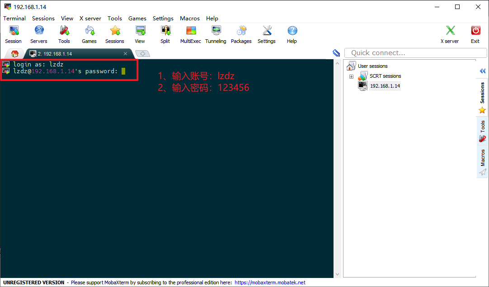

登录成功后，进入终端界面。

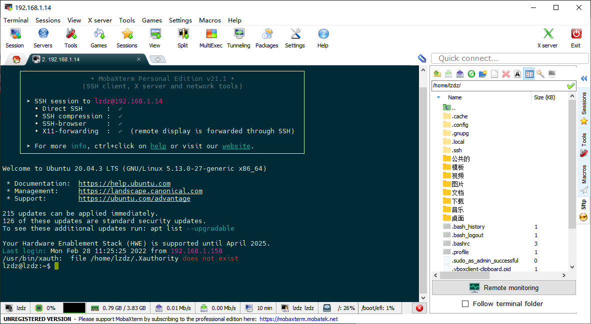

MobaXterm的Session页面中会有连接成功的连接，后续我们直接点击该连接，即可重新连接。

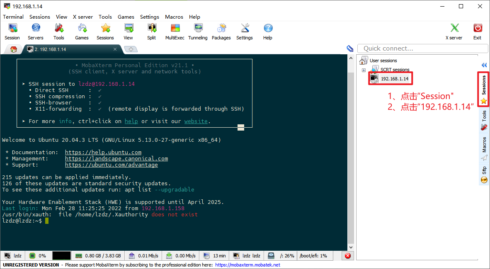

## 5、ubuntu文件映射到windows上

Ubuntu已搭建好samba服务器，windows上可以直接挂载Ubuntu的samba共享文件夹。

在文件管理器中输入\\\192.168.1.14（注意：该IP地址为Ubuntu操作系统的IP地址，具体请参考3.2.4），然后敲回车键，即可进入Ubuntu的samba共享文件夹。

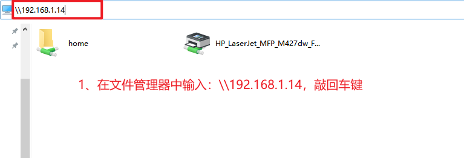

## 6、ubuntu获取源代码获取源

```shell
git clone https://gitee.com/Lockzhiner-Electronics/lockzhiner-rk2206-openharmony3.0lts.git
cd lockzhiner-rk2206-openharmony3.0lts
```

## 7、编译流程

### 7.1、ubuntu编译方式

编译步骤如下所示：

```shell
hb set -root .
hb set
lockzhiner
   lockzhiner-rk2206

选择lockzhiner-rk2206

hb build -f
```

编译出的目标文件在 `out/rk2206/lockzhiner-rk2206/images`目录下。如下图所示：

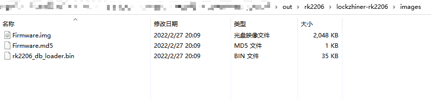

注意：如果用户不使用的我司提供的Linux镜像，可参考docker编译方式。

### 7.2、docker编译方式

#### 7.2.1、安装docker

```shell
sudo apt install docker.io
```

#### 7.2.2、下载镜像

```shell
sudo docker pull swr.cn-south-1.myhuaweicloud.com/openharmony-docker/openharmony-docker:1.0.0
```

#### 7.2.3、开启容器

移动到OpenHarmony主目录下（这里假设OpenHarmony主目录为/home/lzdz/lockzhiner-rk2206-openharmony3.0lts），运行如下命令：

```shell
cd lockzhiner-rk2206-openharmony3.0lts
sudo docker run -it -v /home/lzdz/lockzhiner-rk2206-openharmony3.0lts:/home/openharmony swr.cn-south-1.myhuaweicloud.com/openharmony-docker/openharmony-docker:1.0.0
```

注意：上述“:”的前面字符串是虚拟机本地OpenHarmony源代码主目录，需要根据虚拟机OpenHarmony源代码主目录路径而改变。“:”后面为docker镜像的路径，不需要修改。

接下来，安装相关工具

```shell
# 移动到容器内OpenHarmony主目录，注意容器中主目录变为/home/openharmony
cd /home/openharmony
# 下载编译工具
./build/prebuilts_download.sh
# 安装hb工具
pip3 install build/lite
```

最后，编译OpenHarmony

```shell
hb set -root .
hb set
lockzhiner
   lockzhiner-rk2206
选择lockzhiner-rk2206
hb build -f
```

编译出的目标文件在 `out/rk2206/lockzhiner-rk2206/images`目录下。

#### 7.2.4、关闭容器

关闭容器可以分为2种方式。

（1）容器内关闭容器

```shell
exit
```

（2）本地停止容器运行

```shell
# 列出所有的容器
sudo docker container ls --all
# 根据列出的容器，选择对应的containerID
sudo docker container stop [containerID]
```

注意：使用stop命令需要等待5~10秒才能退出。

#### 7.2.5、重启容器

```shell
# 列出所有的容器
sudo docker container ls --all
# 根据列出的容器，选择对应的containerID
sudo docker container start [containerID]
# 接入到容器中
sudo docker container attach [containerID]
```

#### 7.2.6、删除容器

如果某个容器出现错误或者想删除，则可使用以下命令：

```shell
# 列出所有的容器
sudo docker container ls --all
# 根据列出的容器，选择对应的containerID
sudo docker container rm [containerID]
```

## 8、烧录打印

### 8.1、安装USB驱动

打开USB驱动目录，点击DriverInstall.exe，如下图所示：

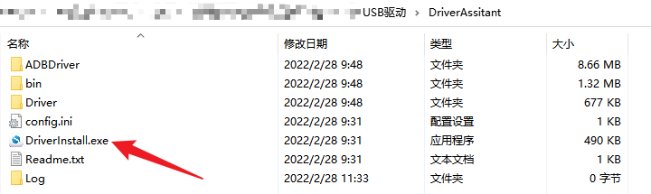

点击 `运行`，如下图所示：

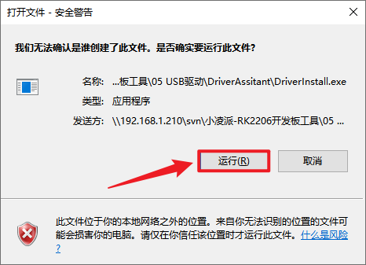

点击 `驱动安装`，如下图所示：

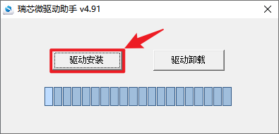

安装完成后退出。

### 8.2、烧写程序

#### 8.2.1、打开RKDevTool

打开烧写工具RKDevTool，点击RKDevTool.exe。如下图所示：

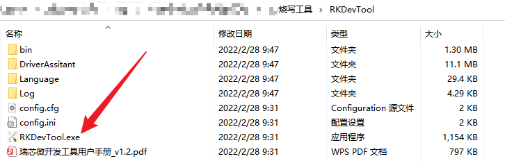

点击运行，如下图所示：

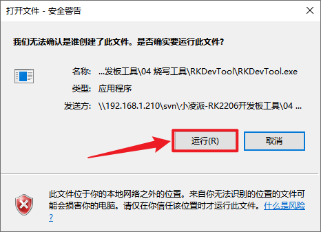

#### 8.2.2、指定烧写文件

（1）指定LoaderToDDR文件

点击红色箭头所指地方，如下图所示：

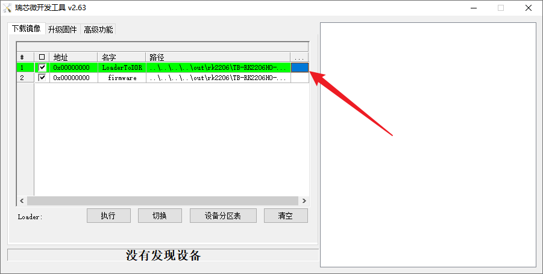

弹出打开对话框，选择主目录下 `out/rk2206/lockzhiner-rk2206/images`，选中 `rk2206_db_loader.bin`文件。如下图所示：

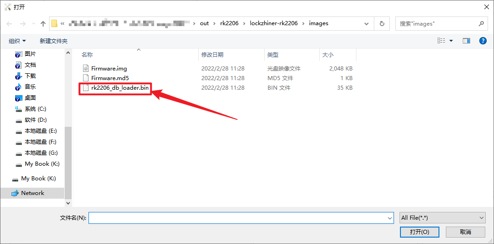

（2）指定fireware文件

点击红色箭头所指地方，如下图所示：

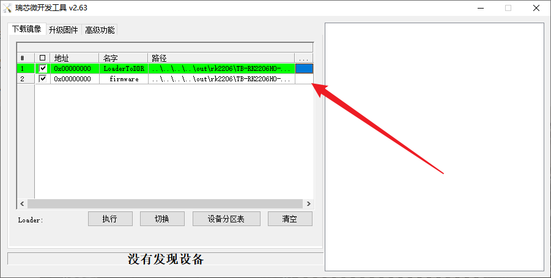

弹出打开对话框，选择主目录下 `ut/rk2206/lockzhiner-rk2206/images`，选中 `Firmware.img`文件。如下图所示：

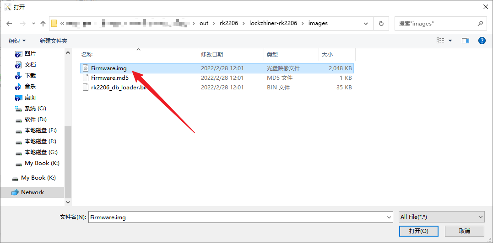

#### 8.2.3、开始烧写

使用USB线，连接小凌派-RK2206开发板的USB-OTG（即烧录口）。如下图所示：

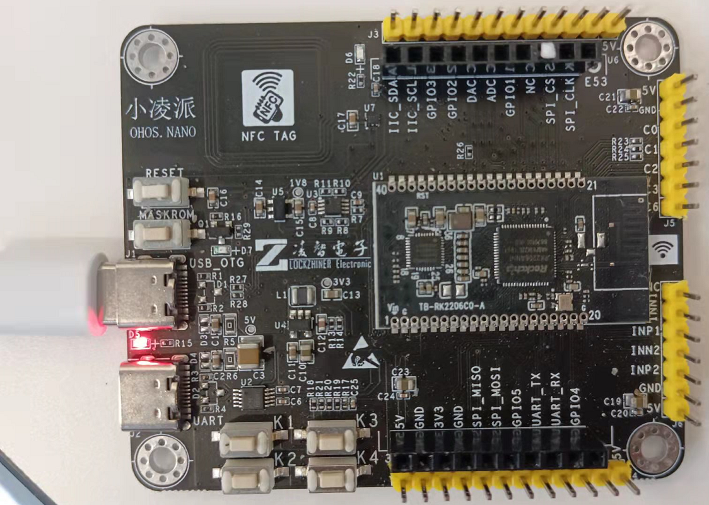

在小凌派-RK2206开发板上，长按MaskRom按键（详见板子的按钮，MaskRom按键不要松开），点击ReSet按键（详见板子的按钮，按下后松开，但MaskRom按键不要松开，大约5秒后松开），烧写工具出现：“发现一个MASKROM设备”。如下图所示：

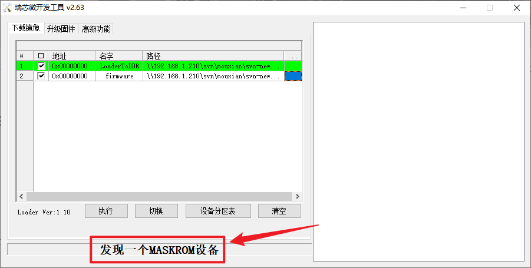

点击 `执行`，下载程序。如下图所示：

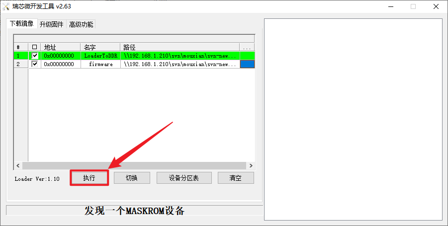

下载完成，如下图所示：

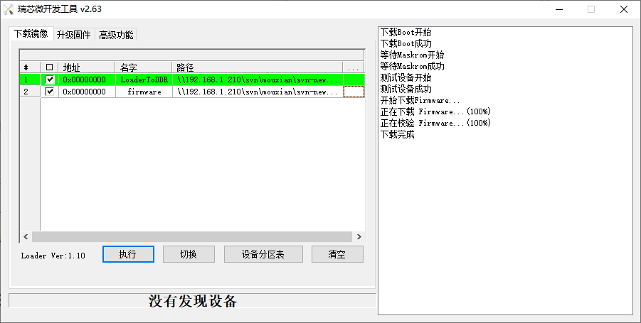

### 8.3、查看打印信息

### 8.3.1、USB线连接设备调试串口

将USB线连接到小凌派-RK2206开发板的UART（即调试串口）。如下图所示：

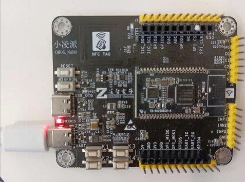

### 8.3.2、Windows查看串口号

在Windows上点击 `我的电脑`，右击选中 `管理`，打开计算机管理对话框。如下所示：

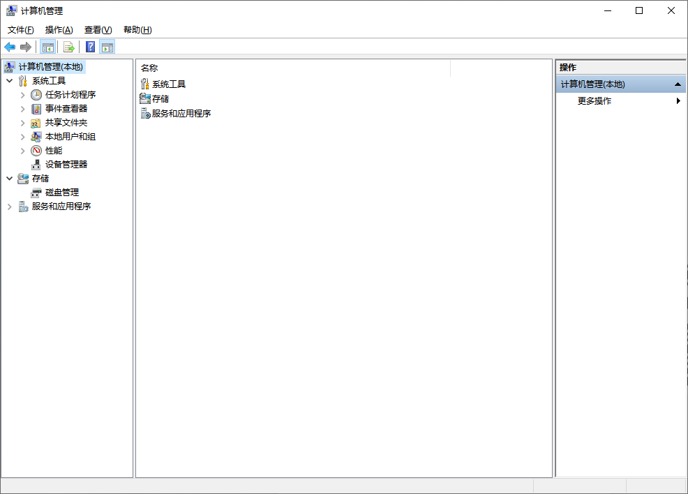

在计算机管理对话框中，点击 `设备管理器`，点击 `端口(COM和LPT)`，查看获知COM3是USB串口线。

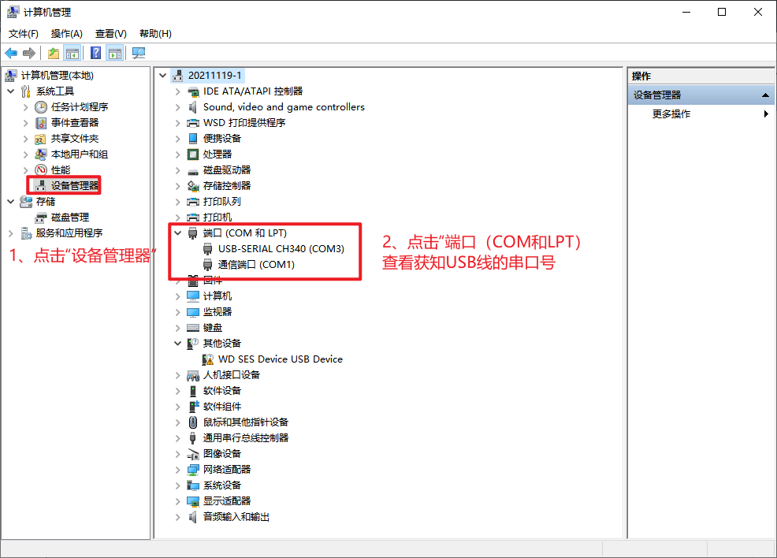

### 8.3.3、查看串口调试信息

打开MobaXterm软件，点击 `Session`，再点击 `Serial`。如下图所示：

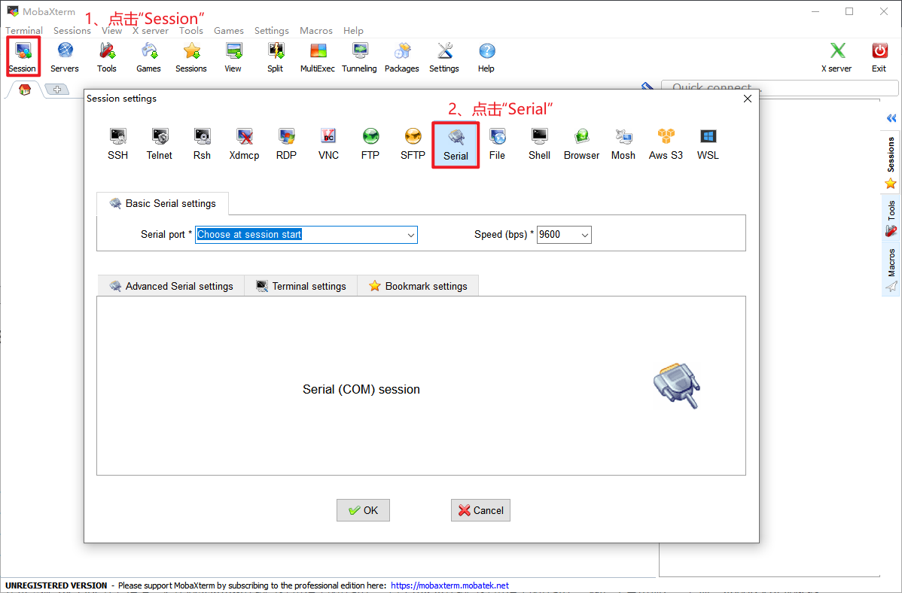

在 `Serial Port`中选择 `COM3`（即在8.3.2中查看的串口号），在 `Speed`中选择 `115200`，最后点击 `OK`。如下图所示：

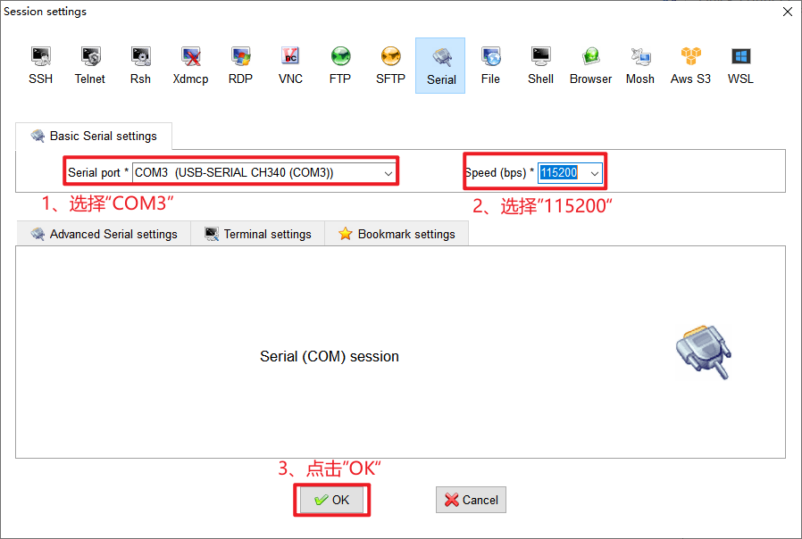

按下小凌派-RK2206开发板的RESET按键，可以查看到如下打印信息：

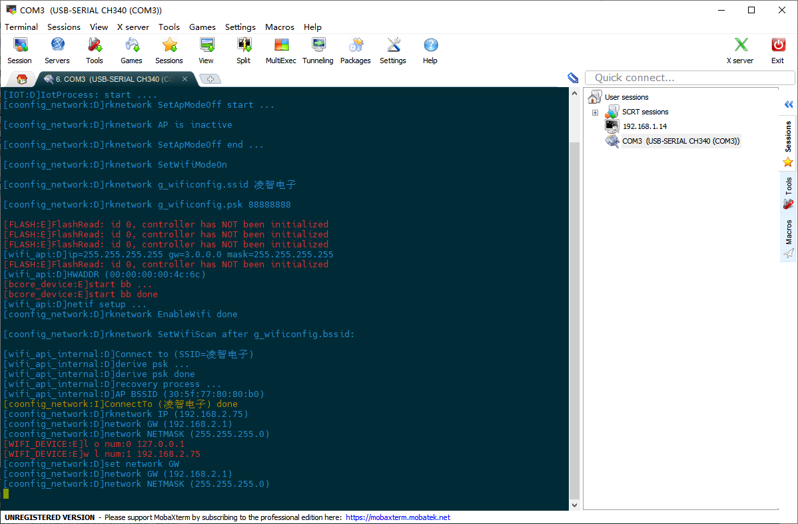

# 相关仓

* [device/rockchip](https://gitee.com/openharmony/device_soc_rockchip)
